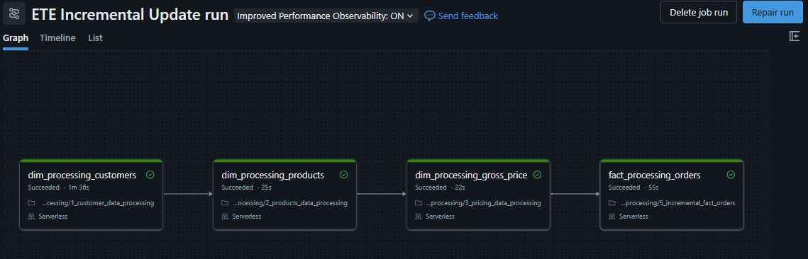

# 🛒 E-Commerce Medallion Pipeline (Databricks)

An enterprise-grade, end-to-end data engineering pipeline built on Databricks using the Medallion Architecture (Bronze → Silver → Gold). This project processes daily e-commerce transactional data for a PC accessories company, standardizing messy child-company records and aggregating them into a conformed, monthly-grain parent company reporting model. 

Building on previous experience developing containerized Airflow and dbt pipelines for hardware sales data, this repository adapts robust orchestration and data quality principles directly into the Databricks Lakehouse ecosystem.

## 🏗️ Architecture & Pipeline Flow

  
  
<em>Automated Databricks Workflow orchestrating the Medallion pipeline</em>

The pipeline handles raw CSV ingestion from AWS S3, cleanses data anomalies (e.g., messy string dates, null quantities), and performs complex incremental recalculations.

*   **🥉 Bronze Layer (Landing & Staging):** Ingests raw wildcard CSVs from the AWS S3 landing zone. Appends full history to a master table while isolating daily incremental files into a `staging_orders` table to prevent full-table rescans. 
*   **🥈 Silver Layer (Cleansing & Conforming):** Reads strictly from Bronze staging. Enforces strict schema typing, drops invalid null quantities, standardizes alphanumeric customer IDs, and safely parses multiple date formats (`try_to_date`). Cleaned records are upserted via Delta `MERGE`.
*   **🥇 Gold Layer (Business Aggregation):** 
    *   **Child Company Fact:** Daily incremental data is merged into the child fact table (`sb_fact_orders`).
    *   **Parent Company Fact (Recalculation):** The pipeline dynamically identifies which months received new data, truncates dates to the month start (`F.trunc`), and recalculates total `sold_quantity` from scratch to prevent double-counting before merging into the central `fact_orders` table.
*   **💎 BI & Consumption:** A denormalized SQL view (`vw_fact_orders_enriched`) joins fact tables with dimension tables (Customers, Products, Gross Price). This view powers an interactive Databricks Dashboard and is fully integrated with Databricks Genie for natural language querying.

## 🛠️ Tech Stack
*   **Compute & Storage:** Databricks, Apache Spark (PySpark), Delta Lake, AWS S3
*   **Transformations & Orchestration:** SQL, Databricks Workflows (Job Tasks)
*   **Visualization:** Databricks Dashboards, Databricks Genie

## 📁 Repository Structure
*   `generate_incremental_orders.py` - Local script to generate mock anomalous CSV data.
*   `notebooks/`
    *   `1_setup_and_utilities.py` - Schema definitions and path configurations.
    *   `2_bronze_ingestion.py` - Raw data load and metadata capture.
    *   `3_silver_transformations.py` - Data cleansing and upserts.
    *   `4_gold_aggregation.py` - Fact generation and monthly roll-ups.
    *   `5_incremental_fact_orders.py` - The isolated staging logic for daily loads.
*   `dashboards/`
    *   `ecommerce_dashboard.lvdash.json` - Exported dashboard configuration.
    *   `dashboard_preview.pdf` - Visual export of the BI deliverables.

## 🚀 How to Run the Pipeline
1.  Upload the initial historical CSV files to your designated `s3://.../orders/landing/` path.
2.  Execute the notebooks in sequence (Bronze → Silver → Gold) to establish the baseline tables.
3.  Run `generate_incremental_orders.py` locally to generate new daily files and upload them to S3.
4.  Trigger the automated **Databricks Workflow Job** to process the incremental files through the staging logic, update the Gold facts, and automatically move the raw CSVs to the `processed/` directory.

---
**Author:** Muheeb Khan  
*Based in Bengaluru, India | Specializing in Data Engineering, AI/ML Integrations, and Analytics.*
